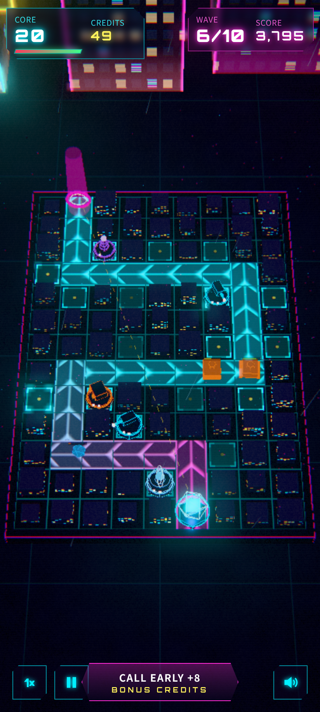

# 霓虹堡壘 NEON BASTION

> 賽博朋克 3D 塔防 · cyberpunk 3D tower defense · 單手玩 one-thumb · Three.js · 手機優先 mobile-first

**試玩 Play:** https://fung2222.github.io/cyber-tower/ · **自動示範 Demo:** https://fung2222.github.io/cyber-tower/?demo=1



## 玩法 How to play
- 病毒同無人機沿住發光嘅**數據通道**衝向**核心**。核心 HP 歸零就失守。
- **點擊發光格子**打開圓形選單起塔；**點擊塔**可以升級（3 級）或出售（退還 70%）。
- 5 種塔：**激光塔**（快速單體）、**冷凍脈衝**（範圍減速）、**導彈塔**（範圍爆炸，打唔到空中）、**電弧塔**（連鎖閃電，專破護盾）、**超頻節點**（加強附近嘅塔）。
- 敵人：快速病毒、裝甲病毒、護盾病毒、分裂病毒、**無人機**（直飛核心，唔跟通道），每 10 波仲有**巨型病毒 Boss**。
- 擊殺有資金，每波完結有**利息**；**提早召喚**下一波有額外獎勵。可以切換 **1×／2× 速度**。
- **戰役：**8 張香港地圖（旺角 → 太平山），每張 3–5 分鐘，按核心剩餘 HP 評 1–3 星。
- **無盡模式：**波數永遠唔會完，難度持續上升；每 10 波係里程碑（額外分數 + 核心回復）。記錄最遠波數同最高分。

## 語言 Language
遊戲支援**繁體中文（香港）**同 **English**，喺主畫面或暫停畫面撳「EN／中」切換，會記住你嘅選擇（`localStorage cyber.lang`，所有 CYBER 遊戲共用）。網址加 `?lang=en` / `?lang=zh` 亦可。

## English
**NEON BASTION** is a one-thumb 3D cyberpunk tower defense built for quick, relaxing sessions. Viruses and drones stream along a glowing data path across a tilted neon city grid toward your core. Tap a glowing pad to build from a radial menu of five towers (laser, cryo pulse, missile, tesla chain lightning and an overclock node that buffs its neighbours), and tap a tower to upgrade it (3 levels) or sell it. Enemies include fast runners, armored tanks, shielded units, splitters, drones that fly straight over the path, and a boss every 10 waves. Earn credits per kill plus interest, call waves early for a bonus and toggle 1×/2× speed. **Campaign:** 8 Hong Kong maps, 3–5 minutes each, 1–3 stars. **Endless:** waves never end; milestones every 10 waves and a saved best wave and high score. Bilingual (Traditional Chinese / English) with an in-game toggle.

## 操作 Controls
| 動作 | 手機 | 鍵盤 |
|---|---|---|
| 起塔 Build | 點格子 → 選塔 Tap pad → pick | 點格子 + 1–5 |
| 升級／出售 Upgrade / sell | 點塔 Tap tower | U / X |
| 下一波 Next wave | 底部按鈕 Bottom button | Space / Enter |
| 速度 Speed | 1× | F |
| 暫停 Pause | ⏸ | P / Esc |
| 靜音 Mute | 🔊 | M |

## 網址參數 URL flags
`?demo=1` AI 自動玩（`&level=1..8`，`0` = 無盡）· `?lang=en|zh` · `?fps=1` · `?quality=low` · `?reset=1` · `?adsim=1` · `?unlockall=1`

## 技術 Tech
Three.js r169 + [cyber-kit](https://github.com/fung2222/cyber-kit) v0.2.1（`vendor/cyber-kit/`），冇 build step，可離線運行。所有模型都係程式生成嘅原創設計；音效同音樂全部合成。

## 開發 Development
```bash
cd .. && python3 -m http.server 18940     # http://127.0.0.1:18940/cyber-tower/
node --test cyber-tower/tests/
node cyber-tower/tests/balance.mjs 0.8
python cyber-tower/tests/smoke.py
```
文件：[docs/HANDOFF.md](docs/HANDOFF.md) · [privacy.html](privacy.html) · 屬於 [CYBER ARCADE](https://github.com/fung2222/cyber-arcade) 系列。
